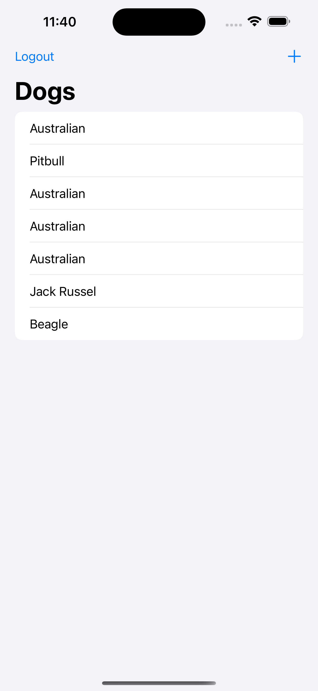

# Simple Login Registration App

This app was developed by:  
1. **Plaban Das** (2007111)  
2. **Choyan Mitra Barua Bijoy** (2007101)  
3. **Sourav Debnath** (2007109)  

## Screenshots  

  <!-- Image 1 -->
  

    
<strong>SignUp Created By Plaban Das</strong> (2007111)

    
  

   

  <!-- Image 2 -->
  

    
<strong>SignIn Created By Plaban Das</strong> (2007111)

    
  

   
  <!-- Image 3 -->
  

    
<strong>ListUI Created By Choyan Mitra Barua Bijoy</strong> (2007101)

    
  

   
  <!-- Image 4 -->
  

    
<strong>Insertion Created By Sourav Debnath</strong> (2007109)

    
  

   
  <!-- Image 5 -->
  

    
<strong>List with Go Back Created By Choyan Mitra Barua Bijoy</strong> (2007101)

    
  

